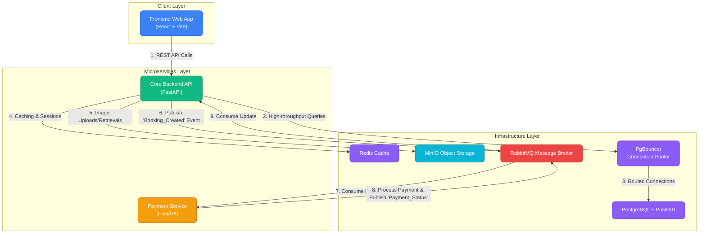

# BookMyVenue - Full Application Documentation

BookMyVenue is a modern, highly concurrent, and scalable platform for discovering and booking venues. It allows users to browse venues using map-based geographical searches, and it enables venue owners (partners) to list and manage their properties. The system is distributed, utilizing a microservices architecture to handle load efficiently.

---

## 🎨 System Flowchart

The following colorful flowchart illustrates the architecture and how data flows through the application:

---

## 🛠️ Technology Stack & Scenario-Based Explanations

### 1. Frontend (Client Layer)
**Technologies Used:** React 19, Vite, TailwindCSS, React-Router, React-Leaflet.
* **Vite & React:** Provides an extremely fast development environment and optimized production builds. React handles complex states like map interactions and dynamic booking forms smoothly.
* **TailwindCSS:** A utility-first CSS framework that allows for rapid, consistent styling without leaving the HTML/JSX.
* **React-Leaflet:** Used for interactive map components. 
    * *Scenario:* When a user searches for a venue "near me," the frontend queries the backend and plots the results on a Leaflet map using latitude and longitude markers.

### 2. Core Backend API
**Technologies Used:** FastAPI (Python), SQLAlchemy 2.0 (Async), Asyncpg.
* **FastAPI:** A modern, fast web framework for building APIs with Python 3.8+ based on standard Python type hints. It supports asynchronous programming out of the box.
    * *Scenario:* A flash sale happens for an elite venue. Thousands of users hit the `/api/v1/venues` endpoint simultaneously. FastAPI's ASGI async nature handles thousands of concurrent requests without blocking the event loop.
* **SQLAlchemy 2.0 & Asyncpg:** The modern standard for Python ORMs combined with the fastest asynchronous PostgreSQL driver. It allows non-blocking database queries.
* **SlowAPI:** Rate limiting middleware. 
    * *Scenario:* A malicious bot attempts to spam the login endpoint. SlowAPI tracks IP addresses and blocks them automatically after a threshold.

### 3. Database Layer
**Technologies Used:** PostgreSQL, PostGIS, PgBouncer.
* **PostgreSQL:** A highly robust open-source relational database.
* **PostGIS (GeoAlchemy2):** An extension for PostgreSQL that adds support for geographic objects.
    * *Scenario:* A user wants venues within a 10km radius of their current location. PostGIS can natively run spatial queries (`ST_DWithin`) against the `geom` column orders of magnitude faster than fetching all venues and calculating distances in Python.
* **PgBouncer:** A lightweight connection pooler for PostgreSQL.
    * *Scenario:* FastAPI can quickly spawn 1,000 async connections to the database, overwhelming PostgreSQL. PgBouncer sits in the middle, managing a pool of 20 active connections and queuing the rest, ensuring the database stays stable under heavy load.

### 4. Distributed Systems & Caching
**Technologies Used:** Redis, RabbitMQ.
* **Redis:** In-memory data structure store used for caching and session management.
    * *Scenario:* The homepage displays the "Top 20 Venues." Instead of querying the database for every user visit, the backend caches this query in Redis. Subsequent users get the data instantly from RAM.
* **RabbitMQ:** A robust message broker for asynchronous microservice communication.
    * *Scenario:* A user books a venue. The backend API creates a "PENDING" booking in the database and publishes a message to RabbitMQ. It immediately tells the user "Booking initiated." The Payment Service, running independently, picks up the message, processes the payment with a 3rd-party gateway, and publishes a success message back to RabbitMQ. The core backend hears this and updates the booking to "CONFIRMED". This prevents the user from staring at a loading spinner for 10 seconds while the payment processes.

### 5. File Storage
**Technologies Used:** MinIO.
* **MinIO:** High-performance, S3-compatible object storage.
    * *Scenario:* A venue owner uploads 15 high-resolution photos of their hall. Storing these in PostgreSQL is an anti-pattern that bloats the database. Instead, the backend uploads them to MinIO, gets a URL, and stores *only the URL* in the database.

### 6. Containerization
**Technologies Used:** Docker, Docker Compose.
* *Scenario:* A new developer joins the team. Instead of spending 3 days installing PostgreSQL, compiling PostGIS, setting up Redis, configuring RabbitMQ, and installing MinIO, they simply run `docker compose up -d`. The entire infrastructure boots up identically across all machines.

---

## 🏗️ Minute Details: Database Schema

The core abstractions (God Nodes) of the system revolve around three main entities:

1. **User Table (`users`)**
   - Handles authentication.
   - `role`: Distinguishes between `CUSTOMER`, `PARTNER` (venue owners), and `SUPER_ADMIN`.
2. **Venue Table (`venues`)**
   - Stores all venue details.
   - `geom`: A PostGIS `Geometry(POINT, 4326)` column storing precise geographic points for fast radius queries.
   - `inventory_type`: Distinguishes if a venue is booked as an `entire_venue` (e.g., a wedding hall) or `capacity_based` (e.g., reserving 5 seats in a co-working space).
3. **Booking Table (`bookings`)**
   - Links Users to Venues.
   - Contains a composite index on `(venue_id, status, start_time, end_time)` to rapidly prevent double-booking overlapping time slots for `entire_venue` properties.

## 🚀 API Endpoint Breakdown

* **`/api/v1/auth/`**: JWT-based stateless authentication login, registration, and token refresh.
* **`/api/v1/venues/`**: Venue discovery. Includes geo-spatial searching, pagination, and filtering by capacity/price.
* **`/api/v1/bookings/`**: Initiates the RabbitMQ saga for payment processing.
* **`/api/v1/admin/`**: High-privilege endpoints for Super Admins to monitor platform usage, delete abusive users, or audit venues.
* **`/api/v1/upload/`**: Secure streaming endpoints to upload files directly into the MinIO buckets.
