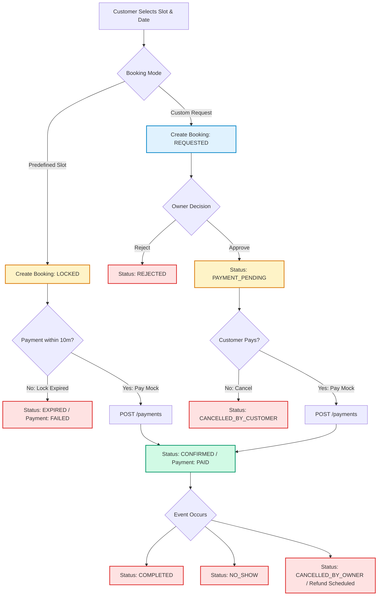
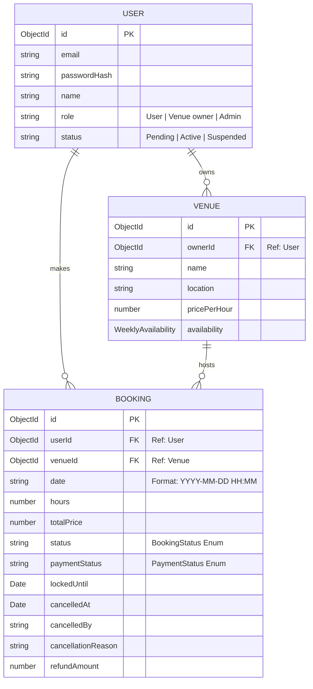
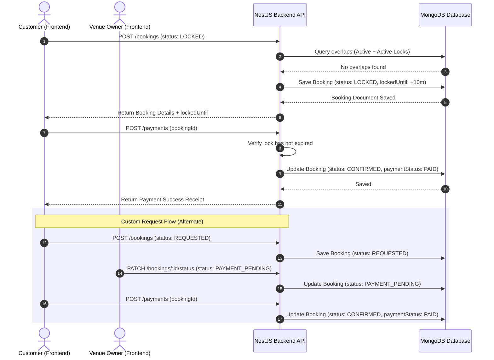

# BookMyVenue: Booking System Architectural Analysis

This document provides a comprehensive, high-fidelity architectural analysis of the existing booking system in the **BookMyVenue** application. It serves as a blueprint for implementing future workflows (Cancellation, Rescheduling, Automatic Completion, and Refund Handling) without disrupting the current codebase.

---

## 1. Booking Lifecycle Flow

The diagram below details the entire booking lifecycle, distinguishing between the **Predefined Slot** path and the **Custom Request** path.



---

## 2. Current Status Transitions Matrix

### 2.1 Supported Booking Statuses
*   `LOCKED`: Temp holding state during the checkout session (10-minute expiry).
*   `REQUESTED`: Initial request state for custom time slot configurations.
*   `PAYMENT_PENDING`: Approved custom request awaiting payment completion.
*   `CONFIRMED`: Finalized and fully paid slot booking.
*   `COMPLETED`: Successfully finalized event date.
*   `CANCELLED_BY_CUSTOMER`: Customer-initiated cancellation.
*   `CANCELLED_BY_OWNER`: Owner-initiated cancellation (triggers refund mechanism if paid).
*   `REJECTED`: Request rejected by the venue owner.
*   `EXPIRED`: Booking lock timeout occurred.
*   `NO_SHOW`: Event date passed without the customer arriving.
*   `CANCELLED` (Legacy): General legacy cancellation.

### 2.2 Status Transition Logic
Below is the transition authorization table checked by `BookingsService.updateStatus`:

| Current Status | Target Status | Authorized Actor | Triggering API Endpoint | Conditions / Effects |
| :--- | :--- | :--- | :--- | :--- |
| **LOCKED** | `CONFIRMED` | Customer (via Pay) | `POST /payments` | `paymentStatus` -> `PAID`, unsets `lockedUntil` |
| **LOCKED** | `EXPIRED` | System (Automatic) | `POST /payments` (on fail) | Lock expires, `paymentStatus` -> `FAILED` |
| **LOCKED** | `CANCELLED` | Customer | `PATCH /bookings/:id/status` | Releases locked slots |
| **REQUESTED** | `PAYMENT_PENDING`| Venue Owner | `PATCH /bookings/:id/status` | Approves custom slot for payment |
| **REQUESTED** | `REJECTED` | Venue Owner | `PATCH /bookings/:id/status` | Rejects custom request |
| **REQUESTED** | `CANCELLED_BY_CUSTOMER` | Customer / Admin | `PATCH /bookings/:id/status` | Customer revokes pending request |
| **PAYMENT_PENDING** | `CONFIRMED` | Customer (via Pay) | `POST /payments` | `paymentStatus` -> `PAID`, unsets `lockedUntil` |
| **PAYMENT_PENDING** | `CANCELLED_BY_OWNER`| Venue Owner / Admin | `PATCH /bookings/:id/status` | Requires reason, schedules refund if paid |
| **PAYMENT_PENDING** | `CANCELLED_BY_CUSTOMER`| Customer / Admin | `PATCH /bookings/:id/status` | Customer decides not to proceed with payment |
| **CONFIRMED** | `COMPLETED` | Venue Owner | `PATCH /bookings/:id/status` | Event occurred successfully. **No further transitions allowed.** |
| **CONFIRMED** | `NO_SHOW` | Venue Owner | `PATCH /bookings/:id/status` | Customer failed to arrive. **No further transitions allowed.** |
| **CONFIRMED** | `CANCELLED_BY_OWNER`| Venue Owner / Admin | `PATCH /bookings/:id/status` | Sets `refundRequestedAt` and `refundAmount` = `totalPrice` |

> [!WARNING]
> **Invalid Transitions / Inflexible State Transitions:**
> 1. Once status becomes `COMPLETED` or `NO_SHOW`, the booking is permanently locked. No transitions (e.g. to refunds or cancellations) are permitted.
> 2. `LOCKED` status does not automatically expire via cron; instead, it is checked lazily when payment is confirmed or when overlapping slots are verified.

---

## 3. Booking API Endpoint Directory

| Method | Endpoint | Caller | Controller Action | Service Method | DB Collections Affected | Purpose |
| :--- | :--- | :--- | :--- | :--- | :--- | :--- |
| **POST** | `/bookings` | Customer | `create()` | `create()` | `bookings` | Initiates new slot lock (`LOCKED`) or custom slot request (`REQUESTED`). Checks time overlap conflicts. |
| **GET** | `/bookings` | Admin | `findAll()` | `findAll()` | `bookings`, `venues`, `users` | Lists all bookings in system. Populates venue and user records. |
| **GET** | `/bookings/user/:userId` | Customer | `findByUser()` | `findByUser()` | `bookings`, `venues` | Fetches bookings history for the specific user. |
| **GET** | `/bookings/owner/:ownerId`| Owner | `findByOwner()` | `findByOwner()` | `bookings`, `venues`, `users` | Fetches bookings made at venues owned by the owner. |
| **GET** | `/bookings/venue/:venueId`| Customer | `findByVenue()` | `findByVenue()` | `bookings`, `users` | Fetches bookings for a specific venue (used to calculate booked slots on date picker). |
| **GET** | `/bookings/:id` | Unified | `findById()` | `findById()` | `bookings`, `venues`, `users` | Details view for a single booking. |
| **PATCH** | `/bookings/:id/status` | Unified | `updateStatus()` | `updateStatus()` | `bookings` | Authorizes status changes with roles-based validation guards. |
| **POST** | `/payments` | Customer | `processPayment()`| `confirmPayment()` | `bookings` | Processes mock checkout, transitions status to `CONFIRMED`. |

---

## 4. Frontend & Backend Flows

### 4.1 Frontend UI Navigation Flow
```
Venue Card (Customer page)
  └─► Click "Book" or "Quick Book"
        └─► Opens VenueSlotsModal Component
              ├─► Datepicker triggers fetch: GET /bookings/venue/:venueId
              ├─► Customer selects:
              │     ├─► Predefined Slot ──► Click Checkout ──► Create Booking (LOCKED)
              │     └─► Custom Slot ──────► Click Request ───► Create Booking (REQUESTED)
              └─► Payment Screen (for LOCKED status):
                    └─► Starts 10-minute timer count-down
                    └─► Complete Mock Payment ──► Calls API POST /payments
                    └─► Triggers onBookSuccess() callback
```

### 4.2 Backend Execution Flow (`updateStatus`)
```
BookingsController.updateStatus()
  └─► Guard: AuthGuard (validates JWT user payload)
  └─► BookingsService.updateStatus(id, status, user, cancellationReason, totalPrice)
        ├─► Fetch booking Document from DB
        ├─► Reject if status is COMPLETED or NO_SHOW
        ├─► Access Control Checks:
        │     ├─► Customer: Allowed targets: CANCELLED_BY_CUSTOMER, CANCELLED. Source must be REQUESTED, PAYMENT_PENDING, or LOCKED.
        │     ├─► Owner:
        │     │     ├─► If source is REQUESTED: Approve (PAYMENT_PENDING) or Reject (REJECTED)
        │     │     ├─► If source is PAYMENT_PENDING: Cancel (CANCELLED_BY_OWNER)
        │     │     └─► If source is CONFIRMED: Completed (COMPLETED), No-show (NO_SHOW), Cancel (CANCELLED_BY_OWNER)
        │     └─► Admin: Allowed targets: CANCELLED_BY_OWNER or CANCELLED_BY_CUSTOMER.
        ├─► Set Cancellation / Refund details if target is CANCELLED_BY_OWNER & paid (refundAmount = totalPrice)
        ├─► DB Update: Model.findByIdAndUpdate() with $unset for lockedUntil
        └─► Return updated document
```

---

## 5. Database Schema & Data Flow



*   **Foreign Keys & Relationships:** 
    *   `Booking.userId` references the `User` schema (Mongoose ref: `'User'`).
    *   `Booking.venueId` references the `Venue` schema (Mongoose ref: `'Venue'`).
    *   `Venue.ownerId` references the `User` schema (Mongoose ref: `'User'`).
*   **Populate Usage:**
    *   `BookingsService.findAll` and `findById` populate both `venueId` and `userId` relations, retrieving full location details and customer/owner names in a single query.

---

## 6. Slot Locking & Double-Booking Prevention

Double-booking conflicts are resolved in **BookingsService.create** using overlapping range algorithms:

1. **Calculate boundaries in minutes:**
   $$\text{TargetStart} = \text{Hour} \times 60 + \text{Minute}$$
   $$\text{TargetEnd} = \text{TargetStart} + (\text{hours} \times 60)$$
2. **Fetch existing bookings** matching the requested date and venue ID.
3. **Filter out inactive statuses:** Overlap verification ignores bookings that are `CANCELLED`, `CANCELLED_BY_CUSTOMER`, `CANCELLED_BY_OWNER`, `REJECTED`, or `EXPIRED`.
4. **Evaluate lock expirations:** Overlap checks ignore `LOCKED` bookings if their `lockedUntil` timestamp is in the past:
   $$\text{lockedUntil} \le \text{Date.now()}$$
5. **Conflict Logic:** If target overlap occurs ($\text{TargetStart} < \text{ExistingEnd} \land \text{ExistingStart} < \text{TargetEnd}$), a `ConflictException` is thrown, aborting booking creation.

---

## 7. Current Architectural Limitations & Risks

1. **Lazy Lock Expiry (Resource Waste):** Locked slots do not release automatically in real-time. If a customer locks a slot and leaves, that slot remains blocked on the UI until someone else tries to query bookings for that venue, triggering lazy evaluation.
2. **Hardcoded Refund Amount:** The refund amount is always hardcoded to the full price (`totalPrice`). It doesn't support percentage-based cancellation penalties.
3. **Lack of Automated Completion:** There is no background system worker or cron to transition bookings from `CONFIRMED` to `COMPLETED` once the booking date passes. Owners must mark them manually.
4. **Poor Status Security Mapping:** Custom request approvals don't require the owner to explicitly provide an authorization header verifying ownership inside `/bookings/:id/status`. It is performed only via logic checking inside the service layer, rather than NestJS route guards.

---

## 8. Extension Points for Planned Features

Here is where the planned features must be added in the code structure:

*   **Cancel Booking (Customer & Owner):**
    *   *Backend Integration*: Update `BookingsService.updateStatus` to add specific status transition validation under `isCustomer` or `isOwner` blocks.
    *   *Frontend Integration*: Add Cancel CTAs on the Bookings page (`frontend/src/app/(customer)/bookings/page.tsx`) triggering `PATCH /bookings/:id/status`.
*   **Reschedule Booking:**
    *   *Backend Integration*: Add a new route `PATCH /bookings/:id/reschedule` in `BookingsController` and corresponding service logic in `BookingsService` to check time slots for the new date/time range.
    *   *Frontend Integration*: Create a new Reschedule Modal in the bookings dashboard UI.
*   **Automatic Completion:**
    *   *Backend Integration*: Create a Scheduled Cron task using NestJS `@nestjs/schedule` module inside a new service (e.g. `BookingsTaskService`) to run hourly and update all `CONFIRMED` bookings with date < `now` to `COMPLETED`.
*   **Refund Handling:**
    *   *Backend Integration*: Create a dedicated `RefundsService` or integrate Stripe/Mock-payment-provider refunds within `confirmPayment` or `updateStatus`. Update `paymentStatus` to `REFUNDED`.

---

## 9. Codebase File Dependency Map

```
(Frontend Components)
frontend/src/app/(customer)/page.tsx (Customer Dashboard)
  └─► frontend/src/components/booking/venue-slots-modal.tsx (Booking modal & timer)
        ├─► frontend/src/lib/axios.ts (API client wrapper)
        └─► (Backend Controllers & Services)
             └─► backend/src/bookings/bookings.controller.ts
                   └─► backend/src/bookings/bookings.service.ts
                         ├─► backend/src/bookings/schemas/booking.schema.ts
                         └─► backend/src/venues/schemas/venue.schema.ts
```

---

## 10. Unified Sequence Diagram

This sequence diagram outlines the entire multi-actor interaction:


