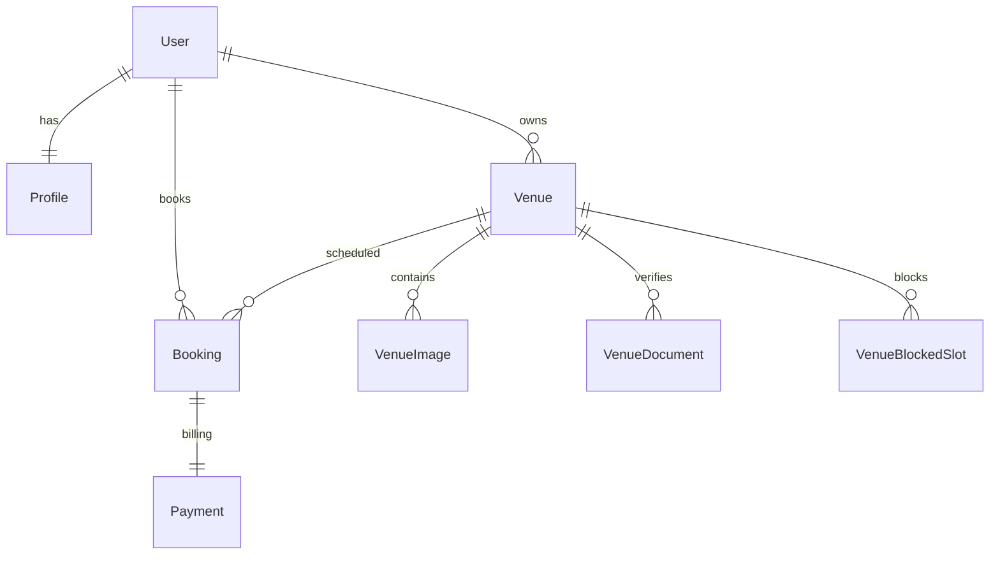
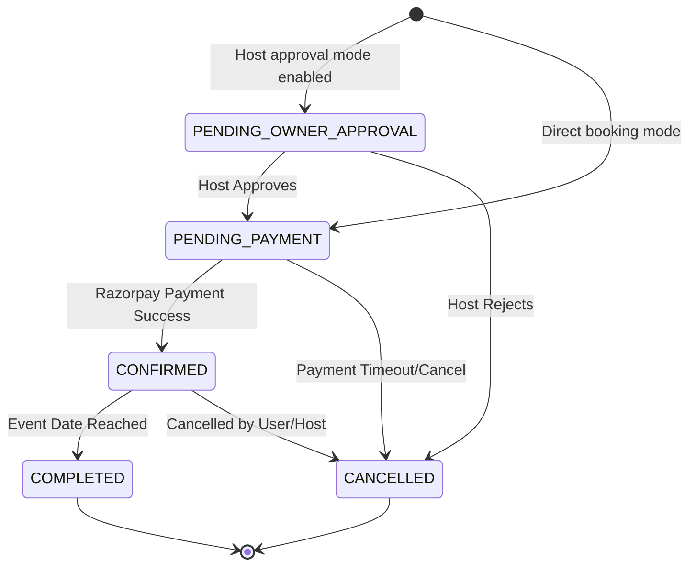

# BookMyVenue Backend Architecture & Developer Documentation

Welcome to the **BookMyVenue** backend architecture guide. The backend is a modular, high-performance web application built using **NestJS**, **Prisma ORM**, and **PostgreSQL**.

This document describes the structure, database schema, security layer, and exact functionalities of all components and modules.

---

## 1. System Overview & Bootstrapping

The application uses a standard NestJS architecture where modules encapsulate controllers, services, and resolvers.

### Entrypoint (`src/main.ts`)
The server bootstraps in [src/main.ts](file:///c:/Users/amith/bmv/BookMyVenue/bmv-main/src/main.ts):
- **CORS Configuration**: Configured to accept credentials and allow origins from `http://localhost:3000` (frontend development server).
- **Validation Pipe**: Installed globally with `whitelist: true` and `transform: true` enabled. This automatically strips undeclared properties from input DTO payloads and parses parameters into correct types.
- **Swagger Documentation**: Bound to `/api-docs` using the NestJS Swagger module, exposing Swagger descriptions and bearer token inputs.
- **Port Binding**: Binds to `process.env.PORT` or defaults to port `4000`.

### Roots Injection (`src/app.module.ts`)
The main [AppModule](file:///c:/Users/amith/bmv/BookMyVenue/bmv-main/src/app.module.ts) coordinates and loads core services and modules:
- Configures global settings via `ConfigModule.forRoot()`.
- Services static asset uploads directly through `ServeStaticModule` mapped to `/uploads` linking files saved on the disk.
- Automatically hooks up all module imports: `AuthModule`, `ProfileModule`, `PrismaModule`, `MailModule`, `StorageModule`, `VenueModule`, `AdminModule`, `SearchModule`, `BookingModule`, and `PaymentModule`.

---

## 2. Database Models & Schema

The relational database layer is managed through Prisma and PostgreSQL.

### Core Models & Relations (`prisma/schema.prisma`)
The models define the relations and state flows:

1. **User**: Represents a system user.
   - Fields: `id`, `email`, `passwordHash`, `googleId`, `role` (Prisma Enum: `USER`, `VENUE_OWNER`, `ADMIN`), `isEmailVerified`, OTP fields.
   - Relations: One-to-one with `Profile`, One-to-many with `Venue` (owner link), One-to-many with `Booking` (guest link).
2. **Profile**: Extended biographical details for a user.
   - Fields: `id`, `name`, `profilePicture`, `phoneNumber`, `address`, `city`, `state`, `country`, `biography`.
3. **Venue**: Main listing spaces.
   - Fields: `id`, `name`, `description`, `city`, `address`, `latitude`, `longitude`, `capacity`, `price`, `categories` (array of category enums), `amenities` (array of amenity enums), `status` (Enum: `PENDING_DOCUMENTS`, `PENDING`, `APPROVED`, `REJECTED`), `rejectionReason`, `bookingApprovalRequired`.
   - Relations: Many-to-one with `User` (owner), One-to-many with `VenueImage`, `VenueDocument`, `Booking`, and `VenueBlockedSlot`.
4. **VenueImage**: Gallery images.
   - Fields: `id`, `imageUrl`, `venueId`.
5. **VenueDocument**: Legal papers uploaded for hosting verification.
   - Fields: `id`, `type` (`GOVERNMENT_ID`, `PROPERTY_DOCUMENT`), `documentUrl`, `venueId`.
6. **Booking**: Event bookings created by Guests.
   - Fields: `id`, `venueId`, `userId`, `eventStart`, `eventEnd`, `eventName`, `status` (Enum: `PENDING_PAYMENT`, `PENDING_OWNER_APPROVAL`, `CONFIRMED`, `COMPLETED`, `CANCELLED`), `guestCount`, `totalAmount`, `specialRequests`.
7. **VenueBlockedSlot**: Blocks custom date ranges by the Host.
   - Fields: `id`, `venueId`, `startDate`, `endDate`, `reason`.
8. **Payment**: Financial records linked to confirmed bookings.
   - Fields: `id`, `bookingId`, `razorpayOrderId`, `razorpayPaymentId`, `razorpaySignature`, `amount`, `status` (Enum: `PENDING`, `SUCCESS`, `FAILED`).
9. **Notification**: In-app user notifications.
   - Fields: `id`, `userId`, `title`, `message`, `read`, `type`.

---

## 3. Security, Guards & Passport Strategies

Security is implemented using Passport middleware and token verification:

### Guards (`src/guard/`)
1. **`JwtAuthGuard`**: Implements standard JWT access locks. Secures endpoints by extracting the bearer token and verifying signatures.
2. **`RolesGuard`**: Checks active session roles using the custom `@Roles(...)` metadata decorator. Compares user role keys from the validated token payload against permitted scopes.
3. **`GoogleAuthGuard`**: Directs authentication calls to Google passport OAuth mechanisms.

### Strategies (`src/strategy/`)
1. **`JwtStrategy`**: Validates JWT payloads signed with `JWT_SECRET`. Attaches a payload object (`userId`, `email`, `role`) to `request.user` on successful checks.
2. **`GoogleStrategy`**: Configured with Google client IDs, scopes, and callback paths to handle secure login redirections.

---

## 4. Modules Walkthrough

The backend contains 10 distinct modules executing dedicated business logic:

### 1. `AuthModule`
Manages identity verification and session creation.
- **Signup Flow**: Creates users with `isEmailVerified: false`. Generates a hashed 6-digit OTP code, saves it to the database, and schedules verification emails.
- **Login Flow**: Validates email credentials via bcrypt hashes, generates a signed JWT token containing the user's role, and returns user details.
- **Google OAuth**: Intercepts social logins. If the email doesn't exist, it creates a new user and profile before returning a session token.
- **Password Reset**: Handles `forgot-password` mail OTPs and updates password hash records.

### 2. `ProfileModule`
Retrieves and updates user profiles.
- `GET /profile/me`: Fetches profile and credentials.
- `PATCH /profile`: Updates biographical info (phone, address, biography, custom avatars).

### 3. `VenueModule`
Maintains venue registries and operations.
- `POST /venue`: Creates a venue listing (status initially sets to `PENDING`).
- `GET /venue/my-venues`: Lists venues created by the requesting owner.
- Host configuration endpoints support blocking custom date ranges (`POST /venue/:id/block-dates`) and toggling booking rules (`PATCH /venue/:id/booking-approval-rule`).

### 4. `BookingModule`
Executes event scheduling.
- **Creation (`POST /bookings`)**: Verifies that the venue exists and that requested slots do not overlap with existing confirmed bookings or blocked slots.
  - If the venue requires approval (`bookingApprovalRequired: true`), sets booking status to `PENDING_OWNER_APPROVAL`.
  - If no approval is required, sets status to `PENDING_PAYMENT` and returns it.
- **Owner Review**: Hosts can fetch pending requests (`GET /bookings/owner/requests`), approve them (`PATCH /bookings/:id/approve` - transitioning status to `PENDING_PAYMENT`), or reject them (`PATCH /bookings/:id/reject`).

### 5. `PaymentModule`
Processes Razorpay payment simulation.
- `POST /payments/create-order`: Simulates Razorpay order creation for bookings set to `PENDING_PAYMENT`.
- `POST /payments/verify`: Validates simulation payments, updates booking status to `CONFIRMED`, and creates transaction records.

### 6. `SearchModule`
Executes public read directories.
- `GET /search`: Returns venue listings using city, capacity, pricing, categories, and availability dates search filters.
- `GET /search/recommended`: Returns popular/verified venues.
- `GET /search/navbar`: Powers the global header quick-search input.

### 7. `AdminModule`
Coordinates listing verification.
- `GET /admin/venues/pending`: Lists all venues waiting for admin review.
- Hosts are verified by admins via approve (`PATCH /admin/venues/:venueId/approve`) and reject (`PATCH /admin/venues/:venueId/reject`) actions.

### 8. `StorageModule`
Handles file upload storage on disk.
- Processes multipart uploads for profile pictures (`POST /storage/profile-picture`), venue cover images (`POST /storage/venue-images`), and verification deeds (`POST /storage/venue-documents`).
- Sanitizes file sizes and extensions using configured Multer storage engines.

### 9. `MailModule`
Configures SMTP transporters to send OTP registration codes and security warnings.

### 10. `PrismaModule`
Instantiates global `PrismaClient` connections, handling safe database hook shut-downs.

---

## 5. Operations State Charts

### Booking Lifecycle Flow

