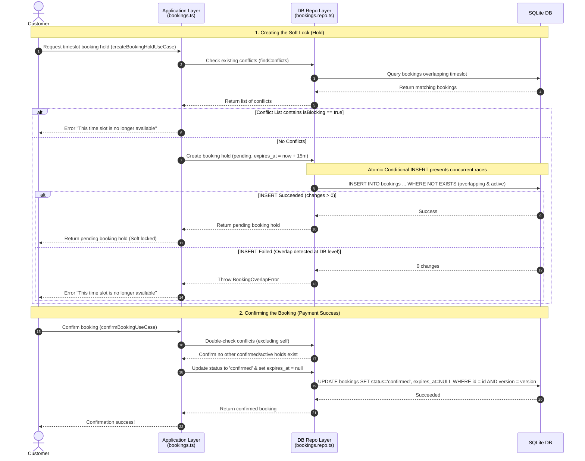

# Booking Soft Lock (Booking Holds)

This document explains the technical implementation of the booking soft lock system in the BookMyVenue application.

---

## 1. Overview & Hold Lifetime

When a customer selects a timeslot and proceeds to checkout, the system creates a **soft lock** on the slot by creating a booking record in the database with a `pending` status. This holds the slot for the customer, allowing them to complete their payment.

* **Hold Duration**: 15 minutes, defined as `HOLD_DURATION_MS = 15 * 60_000` in [@repo/domain/bookings](file:///c:/Users/muham/OneDrive/Documents/GitHub/book-my-venue/packages/domain/src/bookings.ts#L52).
* **Expiration**: Computed as `Date.now() + 15 minutes` via `newHoldExpiry()` when the hold is created.

---

## 2. When is a Slot Blocked? (`isBlocking`)

A timeslot is considered blocked if there is any overlapping booking record that is either:
1. `confirmed` (permanent reservation), or
2. `pending` and has not yet expired (`expires_at > Date.now()`).

This core business rule is implemented in [bookings.ts](file:///c:/Users/muham/OneDrive/Documents/GitHub/book-my-venue/packages/domain/src/bookings.ts#L121-L128):

```typescript
export function isBlocking(
  b: Pick<Booking, "status" | "expires_at">,
  now: number = Date.now(),
): boolean {
  if (b.status === "confirmed") return true;
  if (b.status === "pending" && b.expires_at && new Date(b.expires_at).getTime() > now) return true;
  return false;
}
```

---

## 3. Atomic Database Insertion (Concurrency Control)

To prevent race conditions where two users attempt to hold the exact same timeslot at the same millisecond, the booking repository executes an **Atomic Conditional INSERT** inside [bookings.repo.ts](file:///c:/Users/muham/OneDrive/Documents/GitHub/book-my-venue/packages/infrastructure/src/drizzle/bookings.repo.ts#L119-L163).

Because SQLite serializes write transactions, the check and the write run within a single SQL statement in isolation:

```sql
INSERT INTO bookings (
  id, venue_id, customer_id, start_time, end_time, status, expires_at, ...
)
SELECT ${id}, ${input.venue_id}, ..., 'pending', ${input.expires_at}, ...
WHERE NOT EXISTS (
  SELECT 1 FROM bookings
  WHERE venue_id = ${input.venue_id}
    AND start_time < ${input.end_time}
    AND end_time   > ${input.start_time}
    AND (
          status = 'confirmed'
       OR (status = 'pending' AND expires_at > ${now})
    )
)
```

* If an overlapping active hold or confirmed booking already exists, the `WHERE NOT EXISTS` condition evaluates to false. The query inserts `0` rows.
* The repository checks if any changes were made (`result.meta.changes`). If changes are `0`, it throws a `BookingOverlapError` which is translated to `"This time slot is no longer available"`.

---

## 4. Confirming the Booking (Pending $\rightarrow$ Confirmed)

Once payment succeeds, `confirmBookingUseCase` executes:
1. **Re-Check Conflicts**: It queries for conflicts again (excluding the current booking itself) to guarantee no anomalies occurred.
2. **Optimistic Status Update**: It updates the status to `confirmed` and clears `expires_at` (sets to `null`) to make the booking permanent. It uses Optimistic Locking (`version` version check) to safeguard against concurrency anomalies.

---

## 5. Cleaning Up Expired Holds

* **Dynamic Filtering**: Expired pending holds do not block new bookings because they are filtered out in queries using `expires_at > ${now}`.
* **Administrative Cleanup**: The system defines an administrative task [expireStuckBookingsUseCase](file:///c:/Users/muham/OneDrive/Documents/GitHub/book-my-venue/packages/application/src/admin.ts#L161-L172) that batch-updates stale `pending` bookings to `expired` status for reporting and UI clarity.

---

## 6. Architecture & Sequence Flow Diagram

Below is the execution flow showing how a soft lock is requested, database-guaranteed, and confirmed:


