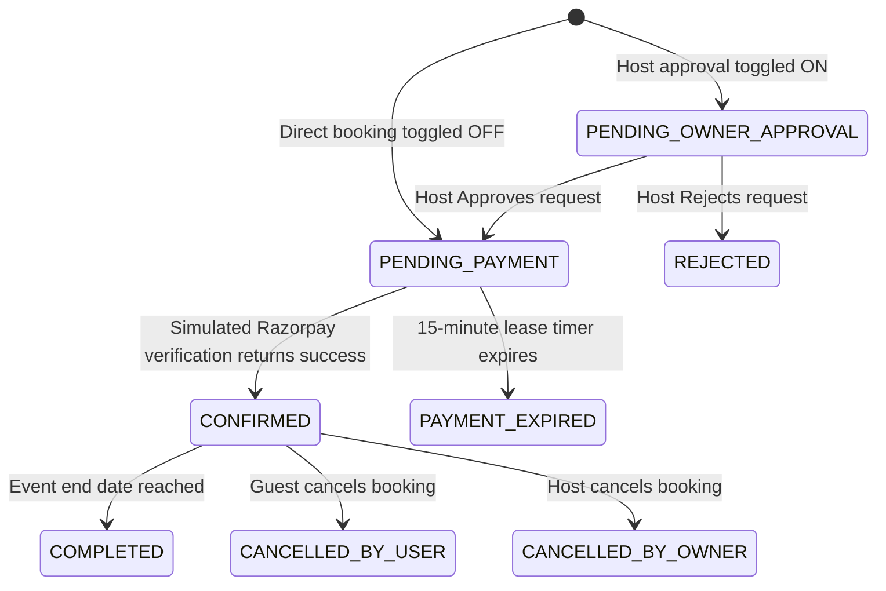

# Booking Logic & Double-Booking Prevention Guide

This document provides a detailed technical breakdown of how **BookMyVenue** handles space reservations, validates scheduling requests, and prevents double-booking (anti-collision) within the database.

---

## 1. The Booking Lifecycle State Machine

A booking reservation transitions through the following states based on the venue's configuration and payment status:



---

## 2. Request Validation Pipeline

When a user triggers a booking request (`POST /bookings`), the backend executes a step-by-step pipeline inside [src/booking/booking.service.ts](file:///c:/Users/amith/bmv/BookMyVenue/bmv-main/src/booking/booking.service.ts):

```
[POST /bookings]
       │
       ▼
1. Validate Chronology ──► Is eventStart < eventEnd? Is eventStart > now?
       │
       ▼
2. Validate Capacity ────► Is guestCount <= venue.capacity?
       │
       ▼
3. Blocked Dates Query ──► Do input dates overlap with VenueBlockedSlot?
       │
       ▼
4. Recycle Stale Leases ─► Expire and release PENDING_PAYMENT slots older than 15m
       │
       ▼
5. Overlap Check (409) ──► Do input dates overlap with active DB bookings?
       │
       ▼
6. Create Booking ───────► Write PENDING record and build Razorpay Order
```

---

## 3. Double-Booking Prevention (Anti-Collision System)

To ensure no two guests can book the same venue for overlapping dates, BookMyVenue employs a mathematical validation approach:

### The Overlap Inequality Formula
An overlap between a requested time interval $[I_{start}, I_{end}]$ and an existing database reservation interval $[D_{start}, D_{end}]$ exists if and only if:

$$D_{start} < I_{end} \quad \text{AND} \quad D_{end} > I_{start}$$

### Database Validation Query
In [src/booking/booking.service.ts](file:///c:/Users/amith/bmv/BookMyVenue/bmv-main/src/booking/booking.service.ts#L164-L180), this is executed using Prisma's `findFirst` query:

```typescript
const existingBooking = await this.prisma.booking.findFirst({
  where: {
    venueId,
    status: {
      in: [
        BookingStatus.PENDING_PAYMENT,
        BookingStatus.PENDING_OWNER_APPROVAL,
        BookingStatus.CONFIRMED
      ],
    },
    eventStart: { lt: eventEnd },
    eventEnd: { gt: eventStart },
  },
});
```

### Explaining the Query Filters:
1. **`venueId`**: Checks are local to the requested venue space.
2. **`status`**: Checks are only run against **active** reservations. Bookings that have been `REJECTED`, `CANCELLED_BY_USER`, `CANCELLED_BY_OWNER`, or `PAYMENT_EXPIRED` are skipped, allowing their slots to be booked.
3. **Interval Constraints**:
   - `eventStart: { lt: eventEnd }` $\rightarrow$ Checks if an existing booking starts *before* the new booking ends.
   - `eventEnd: { gt: eventStart }` $\rightarrow$ Checks if an existing booking ends *after* the new booking starts.

If a record is returned, the system immediately halts the transaction and throws a `409 ConflictException` ("The selected date or time is already reserved.").

---

## 4. Stale Booking Recycling (Lease System)

To prevent users from holding slots indefinitely by locking them in the `PENDING_PAYMENT` state without completing checkout, BookMyVenue implements a temporary lease:

1. **Lease Grant**: When a booking enters the `PENDING_PAYMENT` state, the system sets a payment window limit:
   ```typescript
   paymentExpiresAt = now + 15 minutes
   ```
2. **Active Recycling**: Every new booking transaction calls `expirePendingBookings()` before checking overlaps.
3. **Database Transaction**:
   ```typescript
   await this.prisma.$transaction([
     this.prisma.booking.updateMany({
       where: { id: { in: expiredBookingIds } },
       data: {
         status: BookingStatus.PAYMENT_EXPIRED,
         paymentStatus: PaymentStatus.EXPIRED,
       },
     }),
     this.prisma.payment.updateMany({
       where: { bookingId: { in: expiredBookingIds } },
       data: { status: PaymentStatus.EXPIRED },
     }),
   ]);
   ```
   This clears old pending slots automatically in a single atomic database query, making them immediately available to the incoming client.
