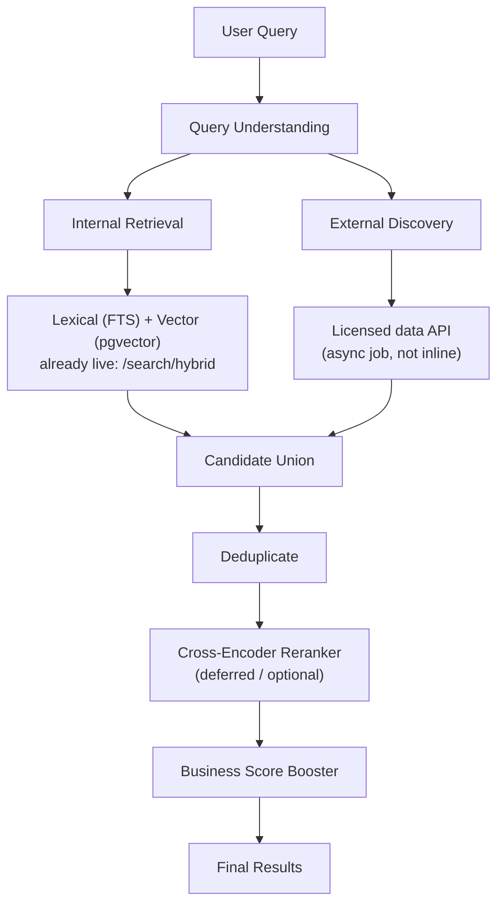

# Venue404 — Deep Research Architecture

> Scope: the "Deep Research" feature — a prompt-driven venue search that ranks internal
> (platform) venues via hybrid search, then optionally augments results with externally
> discovered venues not yet listed on Venue404. Companion doc:
> [Deep Research PRD](../prds/DEEP-RESEARCH-PRD.md) (phased implementation plan, table DDL,
> risks). See also [architecture.md](./architecture.md) and
> [SEARCH-PRD.md](../prds/SEARCH-PRD.md) (the existing hybrid search this feature builds on).
>
> Status: planned, not yet implemented. The user-facing "Deep Research" CTAs currently exist
> as inert UI only (`apps/user-web/src/components/home/{HomeLandingSections,HeroSearch,
> SearchSidebar}.tsx`).

---

## 1. Why this feature exists

Venue404's internal catalog won't have every venue a user wants. Deep Research lets a user
describe what they need in a prompt, get ranked results from the existing venue catalog first,
and — if unsatisfied — pull in candidates sourced from outside the platform. Those external
candidates can be "reserved" by the user; Venue404 staff then manually contact the venue and
either onboard it as a real listing or book on the user's behalf. This is a deliberate
middleman step (not automated), aimed at growing venue supply, commission, and new
venue-owner signups from real user demand signals.

---

## 2. Pipeline

- **Internal retrieval reuses existing infrastructure.** `GET /search/hybrid`
  ([apps/api/app/modules/search/service.py](../apps/api/app/modules/search/service.py))
  already computes `0.6 · ts_rank(FTS) + 0.4 · (1 − cosine_distance(embedding))`, with
  automatic FTS-only fallback when embeddings are missing. Deep Research's first phase is
  purely a new frontend page calling this endpoint — no backend change required.
- **External discovery is new** and runs asynchronously via a job queue (mirrors the existing
  `search_index_jobs` + Upstash pattern in
  [apps/api/app/jobs/search_indexer.py](../apps/api/app/jobs/search_indexer.py)), since
  external lookups are slow and must not block the request/response cycle.
- **Business score booster** always ranks internal (verified, bookable) venues above external
  leads at equal relevance; external results only fill gaps.
- **Cross-encoder reranker** is explicitly deferred — simple relevance + business boosting is
  sufficient for launch.

---

## 3. Data model additions

| Table | Purpose | Notes |
|-------|---------|-------|
| `deep_research_queries` | logs each prompt for traceability/audit | `user_id`, `query_text`, `city_filter` |
| `external_venue_leads` | normalized external candidates | `source`, `raw_contact_info` (admin-only), `status: discovered\|contacted\|onboarded\|rejected` |
| `lead_reservations` | a user's request to reserve an external lead | **not** a `bookings` row — see §4 |

All new tables live in a new backend module, `app/modules/deep_research/`, kept separate from
`search` and `booking` to avoid coupling unrelated state machines.

---

## 4. Why `lead_reservations` is not a `bookings` row

The `bookings` state machine (`requested → accepted → confirmed → ...`) encodes hard,
audited invariants: 24-hour token-payment holds, conflict cancellation, exactly one confirmed
booking per slot (see [CLAUDE.md](../CLAUDE.md) Booking Core Rules). An external lead hasn't
been verified as bookable — it's a manual-outreach target. Routing it through `bookings` would
either violate those invariants or require special-casing them, both worse than keeping
`lead_reservations` a distinct, simpler table (`requested | admin_contacted | owner_confirmed |
declined | expired`) that only becomes a real booking after a lead is promoted to a full
`venues` row through standard venue approval.

---

## 5. Visibility & trust boundaries

- External leads are **always** rendered in a visually distinct section with a disclaimer:
  unverified, reservation is a request only, chance-based, additional platform fee applies.
- `raw_contact_info` on `external_venue_leads` is **admin-only** — never serialized to
  `user-web` API responses.
- Converting a lead into a real venue goes through the standard venue approval flow; the
  platform's visibility invariant (`status = approved AND is_active AND deleted_at IS NULL`)
  is never bypassed for leads.
- Every admin action on a lead or reservation (`lead_contacted`, `lead_onboarded`,
  `lead_rejected`) is written to the existing append-only `admin_actions` audit table.

---

## 6. Rollout phases

1. **Internal-only page** — new `/deep-research` route in `user-web`, calls existing
   `/search/hybrid`, wires up the three currently-dead "Deep Research" CTAs. No schema change.
2. **External discovery** — new tables, async job worker, dedup + business-score ranking,
   badged external results in the UI.
3. **Reservation + admin workflow** — `lead_reservations`, admin panel page for manual
   contact/onboarding, audit logging.

Full task-level breakdown, endpoint list, and risks (licensed-API vs. scraping, PII handling,
async polling UX) are in the [PRD](../prds/DEEP-RESEARCH-PRD.md).
