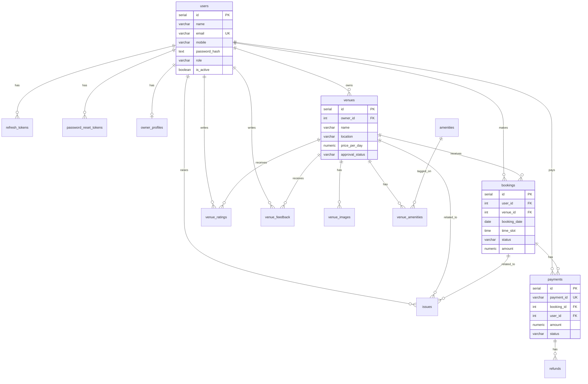

# BookMyVenue — Database Design (PostgreSQL)

**Project:** BookMyVenue  
**Database:** PostgreSQL 15+  
**ORM:** SQLAlchemy (FastAPI backend)

This document defines all tables, relationships, constraints, and indexes for the platform. It aligns with the [API Documentation](./APIDocumentation.md).

---

## Table of Contents

1. [Overview](#1-overview)
2. [Entity Relationship Diagram](#2-entity-relationship-diagram)
3. [Tables](#3-tables)
   - [users](#31-users)
   - [refresh_tokens](#32-refresh_tokens)
   - [password_reset_tokens](#33-password_reset_tokens)
   - [owner_profiles](#34-owner_profiles)
   - [venues](#35-venues)
   - [venue_images](#36-venue_images)
   - [amenities](#37-amenities)
   - [venue_amenities](#38-venue_amenities)
   - [bookings](#39-bookings)
   - [payments](#310-payments)
   - [refunds](#311-refunds)
   - [venue_ratings](#312-venue_ratings)
   - [venue_feedback](#313-venue_feedback)
   - [issues](#314-issues)
4. [API ↔ Database Field Mapping](#4-api--database-field-mapping)
5. [Relationships Summary](#5-relationships-summary)
6. [Indexes](#6-indexes)
7. [Enums & Status Values](#7-enums--status-values)
8. [Sample Seed Data](#8-sample-seed-data)
9. [Migration Notes](#9-migration-notes)

---

## 1. Overview

| Domain        | Tables                                              |
|---------------|-----------------------------------------------------|
| Auth & Users  | `users`, `refresh_tokens`, `password_reset_tokens`, `owner_profiles` |
| Venues        | `venues`, `venue_images`, `amenities`, `venue_amenities` |
| Bookings      | `bookings`                                          |
| Payments      | `payments`, `refunds`                               |
| Feedback      | `venue_ratings`, `venue_feedback`, `issues`         |

**Design principles**

- Use `SERIAL` / `BIGSERIAL` primary keys for internal IDs.
- Use UUID or prefixed string IDs (`pay_abc123`) for external-facing payment IDs.
- Store passwords as bcrypt hashes — never plain text.
- Use `TIMESTAMP WITH TIME ZONE` for all datetime columns.
- Soft-delete is not used in MVP; use `is_active` on users and status fields elsewhere.

---

## 2. Entity Relationship Diagram



---

## 3. Tables

### 3.1 `users`

Stores all platform users: normal users, venue owners, and admins.

```sql
CREATE TABLE users (
    id              SERIAL PRIMARY KEY,
    name            VARCHAR(100) NOT NULL,
    email           VARCHAR(150) NOT NULL UNIQUE,
    mobile          VARCHAR(20),
    password_hash   TEXT NOT NULL,
    role            VARCHAR(20) NOT NULL DEFAULT 'user'
                        CHECK (role IN ('user', 'owner', 'admin')),
    is_active       BOOLEAN NOT NULL DEFAULT TRUE,
    created_at      TIMESTAMPTZ NOT NULL DEFAULT NOW(),
    updated_at      TIMESTAMPTZ NOT NULL DEFAULT NOW()
);
```

| Column          | Type           | Nullable | Description                              |
|-----------------|----------------|----------|------------------------------------------|
| `id`            | SERIAL         | No       | Primary key                              |
| `name`          | VARCHAR(100)   | No       | Full name                                |
| `email`         | VARCHAR(150)   | No       | Unique login email                       |
| `mobile`        | VARCHAR(20)    | Yes      | Phone number                             |
| `password_hash` | TEXT           | No       | Bcrypt-hashed password                   |
| `role`          | VARCHAR(20)    | No       | `user`, `owner`, or `admin`              |
| `is_active`     | BOOLEAN        | No       | `false` when admin deactivates account   |
| `created_at`    | TIMESTAMPTZ    | No       | Account creation time                    |
| `updated_at`    | TIMESTAMPTZ    | No       | Last profile update                      |

---

### 3.2 `refresh_tokens`

Stores refresh tokens for JWT session management and logout invalidation.

```sql
CREATE TABLE refresh_tokens (
    id              SERIAL PRIMARY KEY,
    user_id         INTEGER NOT NULL REFERENCES users(id) ON DELETE CASCADE,
    token_hash      TEXT NOT NULL UNIQUE,
    expires_at      TIMESTAMPTZ NOT NULL,
    revoked_at      TIMESTAMPTZ,
    created_at      TIMESTAMPTZ NOT NULL DEFAULT NOW()
);
```

| Column       | Type        | Nullable | Description                           |
|--------------|-------------|----------|---------------------------------------|
| `id`         | SERIAL      | No       | Primary key                           |
| `user_id`    | INTEGER     | No       | Token owner                           |
| `token_hash` | TEXT        | No       | Hashed refresh token (never store raw)|
| `expires_at` | TIMESTAMPTZ | No       | Token expiry                          |
| `revoked_at` | TIMESTAMPTZ | Yes      | Set on logout                         |
| `created_at` | TIMESTAMPTZ | No       | Issue time                            |

---

### 3.3 `password_reset_tokens`

Temporary tokens for forgot-password flow.

```sql
CREATE TABLE password_reset_tokens (
    id              SERIAL PRIMARY KEY,
    user_id         INTEGER NOT NULL REFERENCES users(id) ON DELETE CASCADE,
    token_hash      TEXT NOT NULL UNIQUE,
    expires_at      TIMESTAMPTZ NOT NULL,
    used_at         TIMESTAMPTZ,
    created_at      TIMESTAMPTZ NOT NULL DEFAULT NOW()
);
```

| Column       | Type        | Nullable | Description                |
|--------------|-------------|----------|----------------------------|
| `id`         | SERIAL      | No       | Primary key                |
| `user_id`    | INTEGER     | No       | User requesting reset      |
| `token_hash` | TEXT        | No       | Hashed reset token         |
| `expires_at` | TIMESTAMPTZ | No       | Typically 1 hour validity  |
| `used_at`    | TIMESTAMPTZ | Yes      | Set when password changed  |
| `created_at` | TIMESTAMPTZ | No       | Token creation time        |

---

### 3.4 `owner_profiles`

Extended profile data for venue owners.

```sql
CREATE TABLE owner_profiles (
    id              SERIAL PRIMARY KEY,
    user_id         INTEGER NOT NULL UNIQUE REFERENCES users(id) ON DELETE CASCADE,
    business_name   VARCHAR(150),
    phone           VARCHAR(20),
    created_at      TIMESTAMPTZ NOT NULL DEFAULT NOW(),
    updated_at      TIMESTAMPTZ NOT NULL DEFAULT NOW()
);
```

| Column          | Type         | Nullable | Description              |
|-----------------|--------------|----------|--------------------------|
| `id`            | SERIAL       | No       | Primary key              |
| `user_id`       | INTEGER      | No       | One profile per owner    |
| `business_name` | VARCHAR(150) | Yes      | Registered business name |
| `phone`         | VARCHAR(20)  | Yes      | Business contact number  |
| `created_at`    | TIMESTAMPTZ  | No       | Record creation          |
| `updated_at`    | TIMESTAMPTZ  | No       | Last update              |

---

### 3.5 `venues`

Venue listings created by owners. Requires admin approval before going public.

```sql
CREATE TABLE venues (
    id                  SERIAL PRIMARY KEY,
    owner_id            INTEGER NOT NULL REFERENCES users(id) ON DELETE CASCADE,
    name                VARCHAR(150) NOT NULL,
    location            VARCHAR(255) NOT NULL,
    price_per_day       NUMERIC(10, 2) NOT NULL CHECK (price_per_day >= 0),
    description         TEXT,
    approval_status     VARCHAR(20) NOT NULL DEFAULT 'pending'
                            CHECK (approval_status IN ('pending', 'approved', 'rejected')),
    rejection_reason    TEXT,
    average_rating      NUMERIC(3, 2) DEFAULT 0.00 CHECK (average_rating >= 0 AND average_rating <= 5),
    total_reviews       INTEGER NOT NULL DEFAULT 0,
    is_active           BOOLEAN NOT NULL DEFAULT TRUE,
    created_at          TIMESTAMPTZ NOT NULL DEFAULT NOW(),
    updated_at          TIMESTAMPTZ NOT NULL DEFAULT NOW()
);
```

| Column              | Type           | Nullable | Description                              |
|---------------------|----------------|----------|------------------------------------------|
| `id`                | SERIAL         | No       | Primary key                              |
| `owner_id`          | INTEGER        | No       | FK → `users.id` (owner role)             |
| `name`              | VARCHAR(150)   | No       | Venue display name                       |
| `location`          | VARCHAR(255)   | No       | City / address                           |
| `price_per_day`     | NUMERIC(10,2)  | No       | Daily rental price (INR)                 |
| `description`       | TEXT           | Yes      | Full venue description                   |
| `approval_status`   | VARCHAR(20)    | No       | `pending`, `approved`, `rejected`        |
| `rejection_reason`  | TEXT           | Yes      | Admin reason when rejected               |
| `average_rating`    | NUMERIC(3,2)   | Yes      | Denormalized avg rating (updated on review) |
| `total_reviews`     | INTEGER        | No       | Count of ratings                         |
| `is_active`         | BOOLEAN        | No       | `false` when admin blocks/removes venue  |
| `created_at`        | TIMESTAMPTZ    | No       | Submission time                          |
| `updated_at`        | TIMESTAMPTZ    | No       | Last edit time                           |

> Public venue queries should filter: `approval_status = 'approved' AND is_active = TRUE`.

---

### 3.6 `venue_images`

Multiple images per venue.

```sql
CREATE TABLE venue_images (
    id              SERIAL PRIMARY KEY,
    venue_id        INTEGER NOT NULL REFERENCES venues(id) ON DELETE CASCADE,
    image_url       TEXT NOT NULL,
    display_order   INTEGER NOT NULL DEFAULT 0,
    created_at      TIMESTAMPTZ NOT NULL DEFAULT NOW()
);
```

| Column          | Type        | Nullable | Description                    |
|-----------------|-------------|----------|--------------------------------|
| `id`            | SERIAL      | No       | Primary key                    |
| `venue_id`      | INTEGER     | No       | FK → `venues.id`               |
| `image_url`     | TEXT        | No       | CDN / storage URL              |
| `display_order` | INTEGER     | No       | Sort order in gallery (0 first)|
| `created_at`    | TIMESTAMPTZ | No       | Upload time                    |

---

### 3.7 `amenities`

Master list of venue amenities (Wi-Fi, Parking, AC, etc.).

```sql
CREATE TABLE amenities (
    id              SERIAL PRIMARY KEY,
    name            VARCHAR(100) NOT NULL UNIQUE,
    created_at      TIMESTAMPTZ NOT NULL DEFAULT NOW()
);
```

| Column       | Type         | Nullable | Description           |
|--------------|--------------|----------|-----------------------|
| `id`         | SERIAL       | No       | Primary key           |
| `name`       | VARCHAR(100) | No       | Unique amenity label  |
| `created_at` | TIMESTAMPTZ  | No       | Record creation       |

---

### 3.8 `venue_amenities`

Many-to-many join between venues and amenities.

```sql
CREATE TABLE venue_amenities (
    id              SERIAL PRIMARY KEY,
    venue_id        INTEGER NOT NULL REFERENCES venues(id) ON DELETE CASCADE,
    amenity_id      INTEGER NOT NULL REFERENCES amenities(id) ON DELETE CASCADE,
    UNIQUE (venue_id, amenity_id)
);
```

| Column       | Type    | Nullable | Description          |
|--------------|---------|----------|----------------------|
| `id`         | SERIAL  | No       | Primary key          |
| `venue_id`   | INTEGER | No       | FK → `venues.id`     |
| `amenity_id` | INTEGER | No       | FK → `amenities.id`  |

---

### 3.9 `bookings`

Core booking records linking users to venues.

```sql
CREATE TABLE bookings (
    id                  SERIAL PRIMARY KEY,
    user_id             INTEGER NOT NULL REFERENCES users(id) ON DELETE CASCADE,
    venue_id            INTEGER NOT NULL REFERENCES venues(id) ON DELETE CASCADE,
    booking_date        DATE NOT NULL,
    time_slot           TIME NOT NULL,
    notes               TEXT,
    amount              NUMERIC(10, 2) NOT NULL CHECK (amount >= 0),
    status              VARCHAR(20) NOT NULL DEFAULT 'pending_payment'
                            CHECK (status IN ('pending_payment', 'booked', 'cancelled')),
    cancellation_reason TEXT,
    cancelled_at        TIMESTAMPTZ,
    created_at          TIMESTAMPTZ NOT NULL DEFAULT NOW(),
    updated_at          TIMESTAMPTZ NOT NULL DEFAULT NOW(),

    UNIQUE (venue_id, booking_date, time_slot)
);
```

| Column                | Type          | Nullable | Description                              |
|-----------------------|---------------|----------|------------------------------------------|
| `id`                  | SERIAL        | No       | Primary key                              |
| `user_id`             | INTEGER       | No       | FK → `users.id` (booker)                 |
| `venue_id`            | INTEGER       | No       | FK → `venues.id`                         |
| `booking_date`        | DATE          | No       | Event date                               |
| `time_slot`           | TIME          | No       | Start time (24-hour)                     |
| `notes`               | TEXT          | Yes      | Special requests from user               |
| `amount`              | NUMERIC(10,2) | No       | Booking price (copied from venue at creation) |
| `status`              | VARCHAR(20)   | No       | `pending_payment`, `booked`, `cancelled` |
| `cancellation_reason` | TEXT          | Yes      | Reason provided on cancel                |
| `cancelled_at`        | TIMESTAMPTZ   | Yes      | When booking was cancelled               |
| `created_at`          | TIMESTAMPTZ   | No       | Booking creation time                    |
| `updated_at`          | TIMESTAMPTZ   | No       | Last status change                       |

> The unique constraint on `(venue_id, booking_date, time_slot)` prevents double-booking the same slot.

---

### 3.10 `payments`

Payment records for booking checkout (Razorpay / Stripe).

```sql
CREATE TABLE payments (
    id                  SERIAL PRIMARY KEY,
    payment_id          VARCHAR(50) NOT NULL UNIQUE,
    booking_id          INTEGER NOT NULL REFERENCES bookings(id) ON DELETE CASCADE,
    user_id             INTEGER NOT NULL REFERENCES users(id) ON DELETE CASCADE,
    amount              NUMERIC(10, 2) NOT NULL CHECK (amount > 0),
    currency            VARCHAR(3) NOT NULL DEFAULT 'INR',
    status              VARCHAR(20) NOT NULL DEFAULT 'created'
                            CHECK (status IN ('created', 'paid', 'failed', 'refunded', 'refund_pending')),
    gateway             VARCHAR(30) NOT NULL DEFAULT 'razorpay'
                            CHECK (gateway IN ('razorpay', 'stripe')),
    gateway_order_id    VARCHAR(100),
    gateway_payment_id  VARCHAR(100),
    gateway_signature   TEXT,
    failure_reason      TEXT,
    paid_at             TIMESTAMPTZ,
    expires_at          TIMESTAMPTZ,
    created_at          TIMESTAMPTZ NOT NULL DEFAULT NOW(),
    updated_at          TIMESTAMPTZ NOT NULL DEFAULT NOW()
);
```

| Column               | Type          | Nullable | Description                              |
|----------------------|---------------|----------|------------------------------------------|
| `id`                 | SERIAL        | No       | Internal primary key                     |
| `payment_id`         | VARCHAR(50)   | No       | External ID (e.g. `pay_abc123`)          |
| `booking_id`         | INTEGER       | No       | FK → `bookings.id`                       |
| `user_id`            | INTEGER       | No       | FK → `users.id` (payer)                  |
| `amount`             | NUMERIC(10,2) | No       | Payment amount                           |
| `currency`           | VARCHAR(3)    | No       | ISO currency code (default `INR`)        |
| `status`             | VARCHAR(20)   | No       | Payment lifecycle status                 |
| `gateway`            | VARCHAR(30)   | No       | `razorpay`, `stripe`                     |
| `gateway_order_id`   | VARCHAR(100)  | Yes      | Order ID from payment gateway            |
| `gateway_payment_id` | VARCHAR(100)  | Yes      | Payment ID from gateway after checkout   |
| `gateway_signature`  | TEXT          | Yes      | Signature for verification               |
| `failure_reason`     | TEXT          | Yes      | Reason if payment failed                 |
| `paid_at`            | TIMESTAMPTZ   | Yes      | Successful payment timestamp             |
| `expires_at`         | TIMESTAMPTZ   | Yes      | Order expiry (unpaid orders)             |
| `created_at`         | TIMESTAMPTZ   | No       | Order creation time                      |
| `updated_at`         | TIMESTAMPTZ   | No       | Last status update                       |

---

### 3.11 `refunds`

Refund records linked to payments (manual or auto on cancellation).

```sql
CREATE TABLE refunds (
    id                  SERIAL PRIMARY KEY,
    refund_id           VARCHAR(50) NOT NULL UNIQUE,
    payment_id          INTEGER NOT NULL REFERENCES payments(id) ON DELETE CASCADE,
    amount              NUMERIC(10, 2) NOT NULL CHECK (amount > 0),
    reason              TEXT NOT NULL,
    status              VARCHAR(20) NOT NULL DEFAULT 'refund_pending'
                            CHECK (status IN ('refund_pending', 'refunded', 'failed')),
    gateway_refund_id   VARCHAR(100),
    initiated_by        INTEGER REFERENCES users(id) ON DELETE SET NULL,
    completed_at        TIMESTAMPTZ,
    created_at          TIMESTAMPTZ NOT NULL DEFAULT NOW()
);
```

| Column              | Type          | Nullable | Description                    |
|---------------------|---------------|----------|--------------------------------|
| `id`                | SERIAL        | No       | Primary key                    |
| `refund_id`         | VARCHAR(50)   | No       | External ID (e.g. `rfnd_xyz789`) |
| `payment_id`        | INTEGER       | No       | FK → `payments.id`             |
| `amount`            | NUMERIC(10,2) | No       | Refund amount (full or partial)|
| `reason`            | TEXT          | No       | Refund reason                  |
| `status`            | VARCHAR(20)   | No       | Refund lifecycle status        |
| `gateway_refund_id` | VARCHAR(100)  | Yes      | ID from payment gateway        |
| `initiated_by`      | INTEGER       | Yes      | FK → `users.id` (admin/user)   |
| `completed_at`      | TIMESTAMPTZ   | Yes      | When refund completed          |
| `created_at`        | TIMESTAMPTZ   | No       | Refund initiation time         |

---

### 3.12 `venue_ratings`

Star ratings and review comments from users.

```sql
CREATE TABLE venue_ratings (
    id              SERIAL PRIMARY KEY,
    venue_id        INTEGER NOT NULL REFERENCES venues(id) ON DELETE CASCADE,
    user_id         INTEGER NOT NULL REFERENCES users(id) ON DELETE CASCADE,
    rating          SMALLINT NOT NULL CHECK (rating >= 1 AND rating <= 5),
    comment         VARCHAR(500),
    created_at      TIMESTAMPTZ NOT NULL DEFAULT NOW(),
    updated_at      TIMESTAMPTZ NOT NULL DEFAULT NOW(),

    UNIQUE (venue_id, user_id)
);
```

| Column       | Type         | Nullable | Description                    |
|--------------|--------------|----------|--------------------------------|
| `id`         | SERIAL       | No       | Primary key                    |
| `venue_id`   | INTEGER      | No       | FK → `venues.id`               |
| `user_id`    | INTEGER      | No       | FK → `users.id` (reviewer)     |
| `rating`     | SMALLINT     | No       | 1–5 stars                      |
| `comment`    | VARCHAR(500) | Yes      | Optional review text           |
| `created_at` | TIMESTAMPTZ  | No       | Review submission time         |
| `updated_at` | TIMESTAMPTZ  | No       | Last edit                      |

> One rating per user per venue. Update `venues.average_rating` and `venues.total_reviews` when a rating is added or changed.

---

### 3.13 `venue_feedback`

General text feedback (separate from star ratings).

```sql
CREATE TABLE venue_feedback (
    id              SERIAL PRIMARY KEY,
    venue_id        INTEGER NOT NULL REFERENCES venues(id) ON DELETE CASCADE,
    user_id         INTEGER NOT NULL REFERENCES users(id) ON DELETE CASCADE,
    message         TEXT NOT NULL,
    created_at      TIMESTAMPTZ NOT NULL DEFAULT NOW()
);
```

| Column       | Type        | Nullable | Description              |
|--------------|-------------|----------|--------------------------|
| `id`         | SERIAL      | No       | Primary key              |
| `venue_id`   | INTEGER     | No       | FK → `venues.id`         |
| `user_id`    | INTEGER     | No       | FK → `users.id`          |
| `message`    | TEXT        | No       | Feedback message         |
| `created_at` | TIMESTAMPTZ | No       | Submission time          |

---

### 3.14 `issues`

User-reported problems related to venues or bookings.

```sql
CREATE TABLE issues (
    id              SERIAL PRIMARY KEY,
    user_id         INTEGER NOT NULL REFERENCES users(id) ON DELETE CASCADE,
    venue_id        INTEGER NOT NULL REFERENCES venues(id) ON DELETE CASCADE,
    booking_id      INTEGER REFERENCES bookings(id) ON DELETE SET NULL,
    subject         VARCHAR(200) NOT NULL,
    description     TEXT NOT NULL,
    status          VARCHAR(20) NOT NULL DEFAULT 'open'
                        CHECK (status IN ('open', 'in_progress', 'resolved', 'closed')),
    admin_note      TEXT,
    resolved_at     TIMESTAMPTZ,
    created_at      TIMESTAMPTZ NOT NULL DEFAULT NOW(),
    updated_at      TIMESTAMPTZ NOT NULL DEFAULT NOW()
);
```

| Column        | Type         | Nullable | Description                          |
|---------------|--------------|----------|--------------------------------------|
| `id`          | SERIAL       | No       | Primary key                          |
| `user_id`     | INTEGER      | No       | FK → `users.id` (reporter)           |
| `venue_id`    | INTEGER      | No       | FK → `venues.id`                     |
| `booking_id`  | INTEGER      | Yes      | FK → `bookings.id` (optional link)   |
| `subject`     | VARCHAR(200) | No       | Short issue title                    |
| `description` | TEXT         | No       | Full issue details                   |
| `status`      | VARCHAR(20)  | No       | `open`, `in_progress`, `resolved`, `closed` |
| `admin_note`  | TEXT         | Yes      | Admin resolution notes               |
| `resolved_at` | TIMESTAMPTZ  | Yes      | When issue was resolved              |
| `created_at`  | TIMESTAMPTZ  | No       | Report time                          |
| `updated_at`  | TIMESTAMPTZ  | No       | Last status update                   |

---

## 4. API ↔ Database Field Mapping

Column names in the [API Documentation](./APIDocumentation.md) match database columns directly. Use this table when implementing serializers and request handlers.

| DB table.column | API JSON field | Notes |
|-----------------|----------------|-------|
| `users.name` | `name` | |
| `users.email` | `email` | |
| `users.mobile` | `mobile` | |
| `users.password_hash` | `password` | Request only; never returned in responses |
| `users.role` | `role` | `user`, `owner`, `admin` |
| `users.is_active` | `is_active` | |
| `users.created_at` | `created_at` | ISO 8601 |
| `users.updated_at` | `updated_at` | ISO 8601 |
| `owner_profiles.business_name` | `business_name` | |
| `owner_profiles.phone` | `phone` | |
| `venues.price_per_day` | `price_per_day` | Not `price` |
| `venues.approval_status` | `approval_status` | `pending`, `approved`, `rejected` |
| `venues.rejection_reason` | `rejection_reason` | Admin reject body/response |
| `venues.is_active` | `is_active` | Admin block sets `false` |
| `venues.average_rating` | `average_rating` | |
| `venues.total_reviews` | `total_reviews` | |
| `venue_images.image_url` | `image_url` | Not `url` |
| `venue_images.display_order` | `display_order` | |
| `bookings.booking_date` | `booking_date` | `YYYY-MM-DD` |
| `bookings.time_slot` | `time_slot` | `HH:MM` in API; `TIME` in DB |
| `bookings.notes` | `notes` | |
| `bookings.amount` | `amount` | Copied from `venues.price_per_day` at creation |
| `bookings.status` | `status` | `pending_payment`, `booked`, `cancelled` |
| `bookings.cancellation_reason` | `cancellation_reason` | Cancel booking request |
| `bookings.cancelled_at` | `cancelled_at` | |
| `payments.payment_id` | `payment_id` | External string ID |
| `payments.status` | `status` / `payment_status` | `payment_status` on booking lists = joined `payments.status` |
| `payments.gateway` | `gateway` | `razorpay`, `stripe` |
| `payments.currency` | `currency` | Default `INR` |
| `payments.gateway_order_id` | `gateway_order_id` | |
| `payments.gateway_payment_id` | `gateway_payment_id` | |
| `payments.gateway_signature` | `gateway_signature` | Verify endpoint only |
| `payments.paid_at` | `paid_at` | |
| `payments.expires_at` | `expires_at` | |
| `refunds.refund_id` | `refund_id` | |
| `refunds.status` | `status` / `refund_status` | `refund_pending`, `refunded`, `failed` |
| `refunds.reason` | `reason` | Refund request body |
| `refunds.amount` | `amount` | |
| `venue_ratings.rating` | `rating` | 1–5 |
| `venue_ratings.comment` | `comment` | Max 500 chars |
| `venue_feedback.message` | `message` | |
| `issues.subject` | `subject` | |
| `issues.description` | `description` | |
| `issues.status` | `status` | `open`, `in_progress`, `resolved`, `closed` |
| `issues.admin_note` | `admin_note` | |
| `issues.resolved_at` | `resolved_at` | Set when status → `resolved` |

### Derived API fields (not stored)

| API field | Source |
|-----------|--------|
| `thumbnail_url` | First `venue_images.image_url` ordered by `display_order` |
| `venue_name`, `user_name`, `owner_name` | Joined from related tables |
| `total_bookings`, `total_revenue` | Aggregated counts/sums |
| `payment_status` on booking responses | Latest `payments.status` for `booking_id` |

### Status transition rules

| Table | Transition |
|-------|------------|
| `venues.approval_status` | `pending` → `approved` (admin approve) or `rejected` (admin reject) |
| `bookings.status` | `pending_payment` → `booked` (payment verified) → `cancelled` (user cancel) |
| `payments.status` | `created` → `paid` or `failed`; `paid` → `refund_pending` → `refunded` |
| `refunds.status` | `refund_pending` → `refunded` or `failed` |

---

## 5. Relationships Summary

| Parent          | Child               | Relationship | On Delete   |
|-----------------|---------------------|--------------|-------------|
| `users`         | `venues`            | One → Many   | CASCADE     |
| `users`         | `bookings`          | One → Many   | CASCADE     |
| `users`         | `payments`          | One → Many   | CASCADE     |
| `users`         | `venue_ratings`     | One → Many   | CASCADE     |
| `users`         | `venue_feedback`    | One → Many   | CASCADE     |
| `users`         | `issues`            | One → Many   | CASCADE     |
| `users`         | `owner_profiles`    | One → One    | CASCADE     |
| `users`         | `refresh_tokens`    | One → Many   | CASCADE     |
| `venues`        | `venue_images`      | One → Many   | CASCADE     |
| `venues`        | `bookings`          | One → Many   | CASCADE     |
| `venues`        | `venue_ratings`     | One → Many   | CASCADE     |
| `venues`        | `venue_feedback`    | One → Many   | CASCADE     |
| `venues`        | `issues`            | One → Many   | CASCADE     |
| `venues`        | `venue_amenities`   | One → Many   | CASCADE     |
| `amenities`     | `venue_amenities`   | One → Many   | CASCADE     |
| `bookings`      | `payments`          | One → Many   | CASCADE     |
| `bookings`      | `issues`            | One → Many   | SET NULL    |
| `payments`      | `refunds`           | One → Many   | CASCADE     |

---

## 6. Indexes

Recommended indexes for query performance:

```sql
-- Users
CREATE INDEX idx_users_email ON users(email);
CREATE INDEX idx_users_role ON users(role);

-- Venues
CREATE INDEX idx_venues_owner_id ON venues(owner_id);
CREATE INDEX idx_venues_approval_status ON venues(approval_status);
CREATE INDEX idx_venues_location ON venues(location);
CREATE INDEX idx_venues_price ON venues(price_per_day);

-- Bookings
CREATE INDEX idx_bookings_user_id ON bookings(user_id);
CREATE INDEX idx_bookings_venue_id ON bookings(venue_id);
CREATE INDEX idx_bookings_date ON bookings(booking_date);
CREATE INDEX idx_bookings_status ON bookings(status);

-- Payments
CREATE INDEX idx_payments_booking_id ON payments(booking_id);
CREATE INDEX idx_payments_user_id ON payments(user_id);
CREATE INDEX idx_payments_status ON payments(status);
CREATE INDEX idx_payments_gateway_order_id ON payments(gateway_order_id);

-- Ratings & Issues
CREATE INDEX idx_venue_ratings_venue_id ON venue_ratings(venue_id);
CREATE INDEX idx_issues_status ON issues(status);
CREATE INDEX idx_issues_user_id ON issues(user_id);

-- Tokens
CREATE INDEX idx_refresh_tokens_user_id ON refresh_tokens(user_id);
CREATE INDEX idx_password_reset_tokens_user_id ON password_reset_tokens(user_id);
```

---

## 7. Enums & Status Values

> These values are identical to [API section 2.8](./APIDocumentation.md#28-shared-enum-values).

### User roles

| Value   | Description        |
|---------|--------------------|
| `user`  | Normal booker      |
| `owner` | Venue owner        |
| `admin` | Platform admin     |

### Venue approval status

| Value      | Description                    |
|------------|--------------------------------|
| `pending`  | Awaiting admin review          |
| `approved` | Live on platform               |
| `rejected` | Rejected by admin              |

### Booking status

| Value              | Description                          |
|--------------------|--------------------------------------|
| `pending_payment`  | Created, awaiting payment            |
| `booked`           | Payment confirmed, slot reserved     |
| `cancelled`        | Cancelled by user or system          |

### Payment status

| Value            | Description                |
|------------------|----------------------------|
| `created`        | Order created, not paid    |
| `paid`           | Payment successful         |
| `failed`         | Payment attempt failed     |
| `refund_pending` | Refund in progress         |
| `refunded`       | Fully refunded             |

### Refund status (`refunds.status`)

| Value            | Description              |
|------------------|--------------------------|
| `refund_pending` | Initiated, processing    |
| `refunded`       | Completed                |
| `failed`         | Refund failed            |

### Payment gateway (`payments.gateway`)

| Value      | Description        |
|------------|--------------------|
| `razorpay` | Default gateway    |
| `stripe`   | Alternate gateway  |

### Issue status (`issues.status`)

| Value         | Description              |
|---------------|--------------------------|
| `open`        | Newly reported           |
| `in_progress` | Admin is investigating   |
| `resolved`    | Issue fixed              |
| `closed`      | Closed without action    |

---

## 8. Sample Seed Data

Use for local development and testing:

```sql
-- Admin user (password: admin123 — hash in app)
INSERT INTO users (name, email, mobile, password_hash, role)
VALUES ('Admin User', 'admin@bookmyvenue.com', '9000000001', '$2b$12$placeholder', 'admin');

-- Owner
INSERT INTO users (name, email, mobile, password_hash, role)
VALUES ('Venue Owner', 'owner@bookmyvenue.com', '9000000002', '$2b$12$placeholder', 'owner');

-- Normal user
INSERT INTO users (name, email, mobile, password_hash, role)
VALUES ('Alan', 'alan@gmail.com', '9090900000', '$2b$12$placeholder', 'user');

-- Amenities
INSERT INTO amenities (name) VALUES
    ('Wi-Fi'), ('Parking'), ('AC'), ('Projector'), ('Stage'), ('Catering');

-- Owner profile
INSERT INTO owner_profiles (user_id, business_name, phone)
VALUES (2, 'Alan Events Pvt Ltd', '9000000002');

-- Venue (approved)
INSERT INTO venues (owner_id, name, location, price_per_day, description, approval_status)
VALUES (2, 'Grand Hall', 'Kochi, Kerala', 10000.00, 'Large event venue with stage and seating for 500', 'approved');

-- Venue amenities
INSERT INTO venue_amenities (venue_id, amenity_id) VALUES (1, 1), (1, 2), (1, 3);

-- Venue image
INSERT INTO venue_images (venue_id, image_url, display_order)
VALUES (1, 'https://cdn.example.com/venues/1/img1.jpg', 0);
```

> Replace `$2b$12$placeholder` with real bcrypt hashes generated by the application.

---

## 9. Migration Notes

### Development

For quick local setup only:

```python
Base.metadata.create_all(bind=engine)
```

### Production

Always use Alembic migrations:

```bash
cd backend
alembic init migrations
alembic revision --autogenerate -m "initial schema"
alembic upgrade head
```

See [database production guide](./database/database_production.md) for details.

### Suggested migration order

1. `users`
2. `refresh_tokens`, `password_reset_tokens`
3. `owner_profiles`
4. `venues`, `amenities`, `venue_amenities`, `venue_images`
5. `bookings`
6. `payments`, `refunds`
7. `venue_ratings`, `venue_feedback`, `issues`

---

## Related Documents

- [API Documentation](./APIDocumentation.md)
- [System Design](./SystemDesign.md)
- [Product Requirements (PRD)](./PRD.md)
- [Folder Architecture](./FolderArchitecture.md)
- [Backend Setup](../backend/README.md)

---

**Last updated:** June 2026
