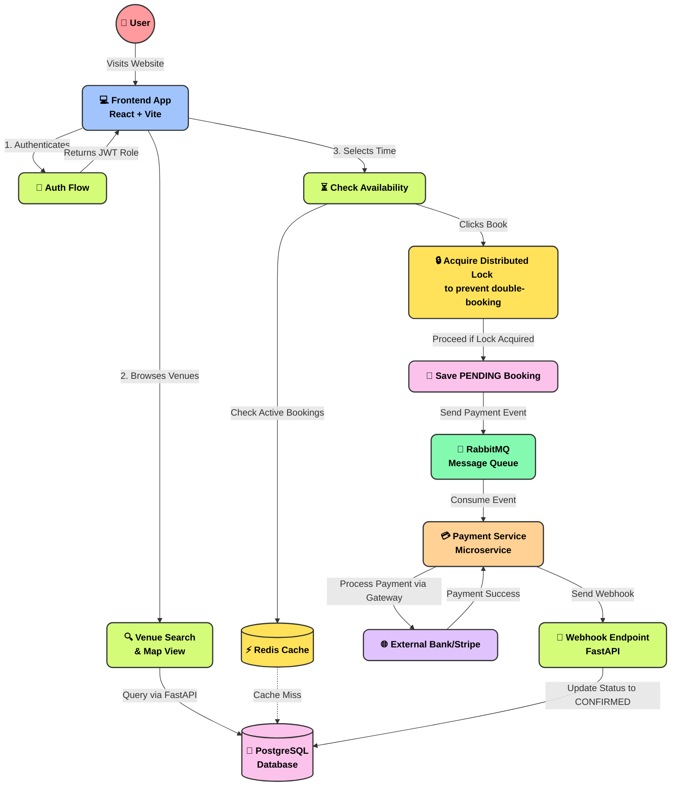

# BookMyVenue Application Flowchart

Here is a visual, easy-to-understand breakdown of how data flows through the BookMyVenue system.

### Flow Breakdown:
1. **User Interaction (Pink)**: The user starts at the React frontend.
2. **Frontend Operations (Blue)**: The frontend splits traffic to Auth, Venue Browsing, or Availability checks based on user actions.
3. **Backend Processing (Green)**: FastAPI handles these requests.
4. **Caching & Locks (Yellow)**: Redis is used heavily for quick availability checks and to lock venues so two people can't book the exact same slot at the exact same time.
5. **Database (Light Pink)**: PostgreSQL safely stores the venues, users, and bookings.
6. **Asynchronous Payments (Mint/Orange)**: Once a booking is marked as `PENDING`, RabbitMQ safely hands the payment task to a separate service to avoid slowing down the main app.
7. **Webhook Confirmation (Green)**: The payment service informs the backend that payment succeeded, changing the booking to `CONFIRMED`.
